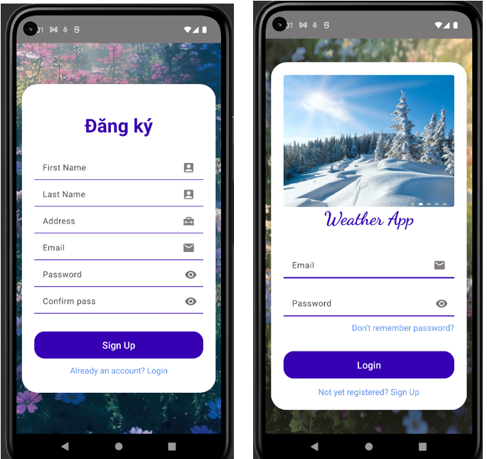
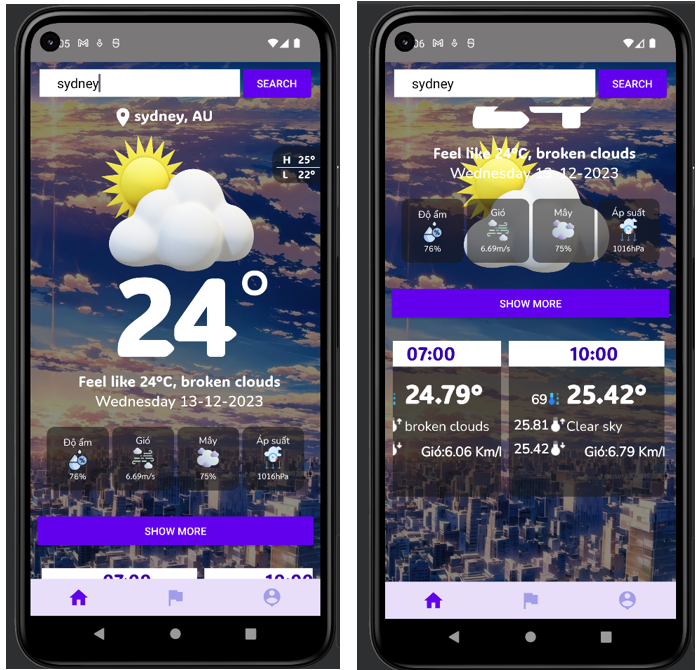
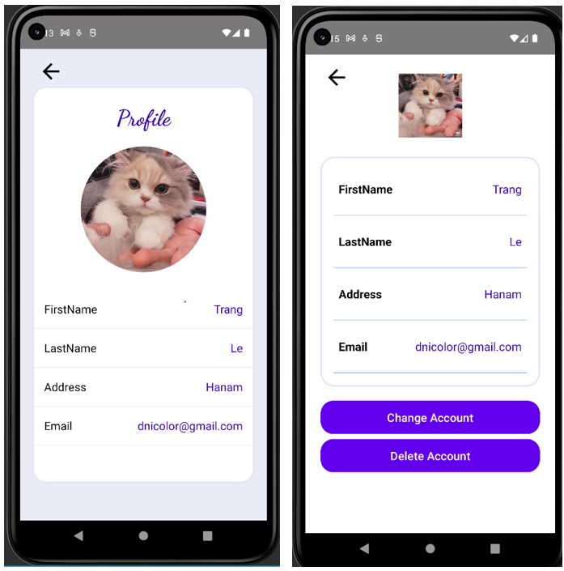

# THE WEATHER APP - ANDROID
## Introduction
> I have developed a weather application from start to finish in Java language. I store data using firebase, sqlite.
> Some basic functions: log in, register, retrieve password, change personal information, display weather information by search city, etc..
## ScreenShot

